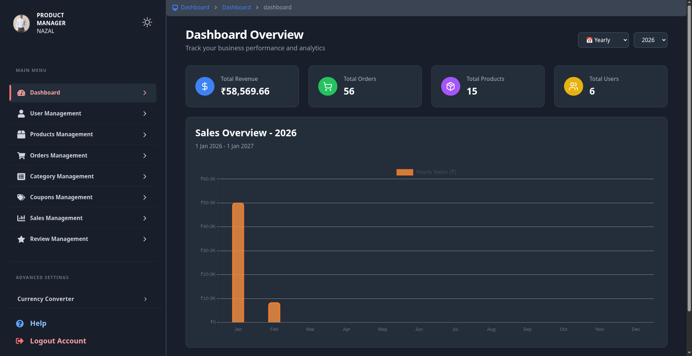

<h1 align="center">🛒 Full-Stack Ecommerce Platform</h1>

<h3 align="center">
Production-Ready MERN Commerce Infrastructure
</h3>

<p align="center">
A scalable ecommerce platform built with the MERN stack, featuring secure authentication, payment processing, analytics dashboards, media management, and modern deployment workflows.
</p>

<p align="center">
  
  
  
  
  
  
</p>

<p align="center">
  <a href="#-overview">Overview</a> •
  <a href="#-features">Features</a> •
  <a href="#-architecture">Architecture</a> •
  <a href="#-quick-start">Quick Start</a> •
  <a href="#-api-reference">API</a>
</p>

---

# 📌 Overview

This project is a production-focused ecommerce platform designed around secure authentication, scalable order processing, and modern payment workflows.

The application uses a React + Vite frontend for high-performance rendering and an Express/MongoDB backend for API management, business logic, and analytics.

Core integrations include:

- **Razorpay** for payment processing
- **Cloudinary** for media storage
- **Google OAuth** for authentication
- **Resend** for transactional email delivery

---

# 🚀 Features

## 👤 Authentication & Security

- JWT-based authentication
- Refresh token session handling
- Google OAuth login
- Protected admin routes
- OTP verification system
- Secure password hashing with bcrypt

---

## 🛍️ Ecommerce Functionality

- Product catalog & category management
- Cart & wishlist system
- Coupon engine
- Wallet integration
- Product reviews & ratings
- Order management pipeline
- Side-by-side product comparison

---

## 📊 Admin & Analytics

- Sales analytics dashboard
- Revenue insights
- Order tracking
- Product management
- User management
- Inventory monitoring

---

## ☁️ Media & Infrastructure

- Cloudinary media uploads
- Dockerized backend deployment
- RESTful API architecture
- Environment-based configuration
- Centralized error handling

---

# 🛠️ Tech Stack

| Layer | Technologies |
|---|---|
| Frontend | React, Vite, TailwindCSS |
| Backend | Node.js, Express.js |
| Database | MongoDB, Mongoose |
| Authentication | JWT, Google OAuth |
| Payments | Razorpay |
| Media Storage | Cloudinary |
| Email Service | Resend |
| Infrastructure | Docker |

---

# 🏗️ System Architecture

```text
Client (Browser)
       │
       ▼
React Frontend (Vite)
       │
 REST API / JWT
       │
       ▼
Express Backend
       │
 ┌─────┼────────┬─────────┐
 ▼     ▼        ▼         ▼
MongoDB Cloudinary Resend Razorpay
```

---

# 📂 Project Structure

```bash
ecommerce-app/
│
├── backend/
│   ├── config/
│   ├── controllers/
│   ├── middleware/
│   ├── models/
│   ├── routes/
│   └── utils/
│
├── frontend/
│   ├── public/
│   └── src/
│       ├── components/
│       ├── pages/
│       ├── redux/
│       └── services/
│
├── .env.example
└── README.md
```

---

# ⚡ Engineering Highlights

- Modular MVC backend architecture
- Role-based access control (RBAC)
- Optimized MongoDB query structure
- Centralized API error handling
- Secure token-based authentication flow
- Reusable frontend component system
- Scalable REST API organization

---

# 🔒 Security Features

- HTTP-only secure cookies
- JWT access & refresh token flow
- Password hashing with bcrypt
- Protected admin APIs
- Input validation & sanitization
- Secure Razorpay payment verification

---

# 📈 Performance Optimizations

- Vite-powered frontend builds
- Lazy-loaded frontend routes
- Optimized Cloudinary image delivery
- Pagination for product queries
- Aggregation pipelines for analytics
- Debounced search functionality

---

# 🏁 Quick Start

## Prerequisites

- Node.js
- MongoDB instance
- Docker (optional)

---

## 1️⃣ Clone Repository

```bash
git clone https://github.com/yourusername/ecommerce-app.git

cd ecommerce-app
```

---

## 2️⃣ Install Dependencies

### Backend

```bash
cd backend
npm install
```

### Frontend

```bash
cd frontend
npm install
```

---

## 3️⃣ Configure Environment Variables

Create environment files using `.env.example`.

### Backend

```env
PORT=5000
MONGO_URI=
JWT_SECRET=
RAZORPAY_KEY_ID=
RAZORPAY_KEY_SECRET=
CLOUDINARY_CLOUD_NAME=
```

### Frontend

```env
VITE_SERVER_URL=http://localhost:5000
VITE_GOOGLE_CLIENT_ID=
VITE_RAZORPAY_KEY=
```

---

## 4️⃣ Run Development Servers

### Backend

```bash
cd backend
npm run dev
```

### Frontend

```bash
cd frontend
npm run dev
```

---

# 📡 API Reference

## Base URL

```bash
http://localhost:5000/api
```

| Endpoint | Description |
|---|---|
| `/users` | Authentication & profile management |
| `/products` | Product CRUD & listings |
| `/category` | Category management |
| `/orders` | Order processing |
| `/cart` | Shopping cart |
| `/wallet` | Wallet transactions |
| `/coupons` | Coupon management |
| `/reviews` | Product reviews |
| `/sales` | Analytics & reporting |
| `/admin` | Admin utilities |

---

# 🐳 Docker Deployment

## Build Backend Image

```bash
docker build -t ecommerce-backend ./backend
```

## Run Container

```bash
docker run --name ecommerce-backend \
  -p 5000:5000 \
  --env-file backend/config/.env \
  ecommerce-backend
```

---

# 🚀 Deployment Stack

| Service | Platform |
|---|---|
| Frontend | Vercel |
| Backend | Render / Railway / EC2 |
| Database | MongoDB Atlas |
| Media Storage | Cloudinary |
| Payments | Razorpay |

---

# 📸 Screenshots




---

# 🧪 Future Improvements

- Redis caching layer
- Microservices architecture
- Elasticsearch product search
- Automated testing pipeline
- CI/CD integration
- Multi-vendor support

---

# 📝 License

Released under the MIT License.